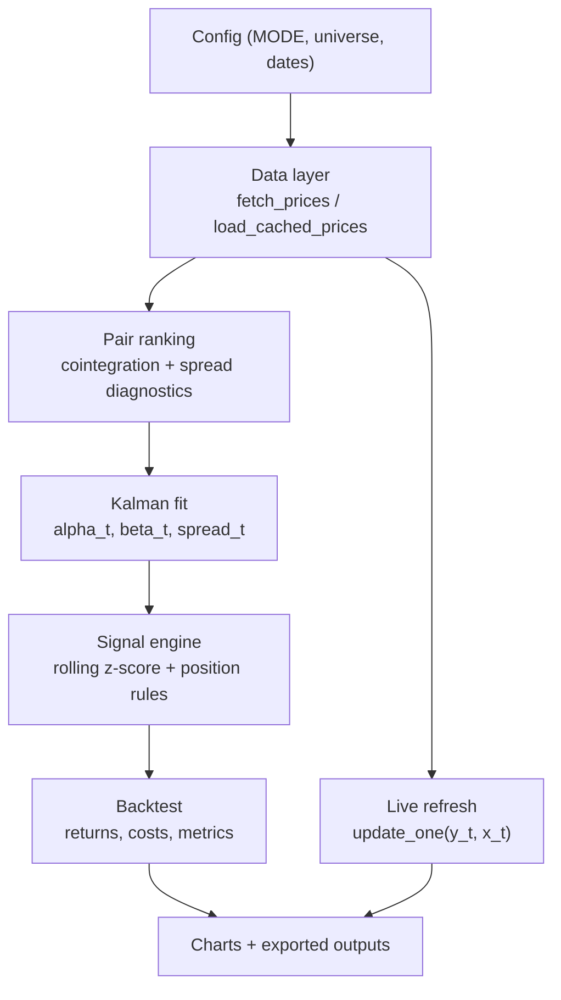

# Kalman Filter Pairs Trading Notebook

Notebook-first stat-arb project that uses a Kalman filter to estimate a **dynamic hedge ratio** for pairs trading in US equities.

## What this project shows

- Dynamic linear state-space model for `y_t = alpha_t + beta_t x_t + e_t`
- Pair scanning and ranking over a ticker universe with `pvalue <= 0.05` filtering
- Mean-reversion signal generation from normalized Kalman innovation (`innovation / sqrt(spread_var)`)
- Backtest with transaction costs and core performance metrics
- Dual data workflow:
  - **Live pull** via `yfinance`
  - **Predownloaded cache** via local CSV/parquet

## Repository layout

- `notebooks/kalman_pairs_trading.ipynb`: end-to-end research notebook
- `src/kalman_pairs`: reusable package modules
- `tests`: unit + integration tests
- `data/cache`: local cached market data
- `outputs`: exported artifacts from notebook runs

## Architecture



## Setup

```bash
python -m venv .venv
source .venv/bin/activate
pip install -e .[dev]
```

If editable install is not supported in your pip version:

```bash
pip install -r requirements.txt
```

## Run tests

```bash
pytest -q
```

## Run notebook

Open and run:

- `notebooks/kalman_pairs_trading.ipynb`

Inside notebook, set:

- `MODE = "live"` for on-demand `yfinance` pull (default)
- `MODE = "cache"` for offline/reproducible cached data path

Notebook exports:

- `outputs/selected_pairs.csv`
- `outputs/trades.csv`
- `outputs/equity_curve.csv`

## Practical lessons from production-style Kalman usage

- **Tune process noise before overfitting entry/exit thresholds**: if beta adapts too slowly, spreads look stationary when they are not; too quickly, you over-trade noise.
- **Lag what would be unknown at decision time**: strategy returns should use prior position and prior beta where applicable.
- **Build cache-first workflows**: market APIs fail and rate-limit; reproducible offline runs are critical for debugging and demos.
- **Evaluate turnover and cost drag early**: many promising raw signals collapse after realistic transaction costs.

## Limitations

- Research/backtest scope only; no order routing or broker integration in this version.
- Daily bars only in default workflow.
- Pair ranking is intentionally lightweight; production deployment would add regime checks and execution constraints.
